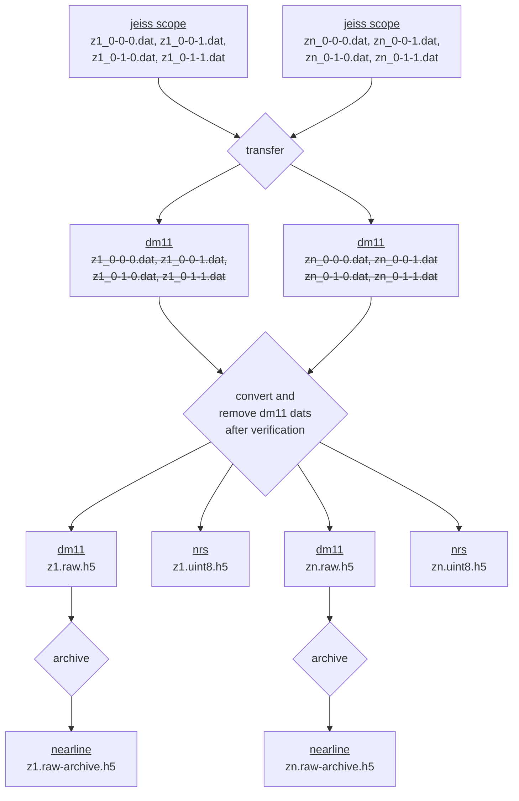

```mermaid
graph TD
    SCOPE_DAT_A[<u>jeiss scope</u><br> z1_0-0-0.dat, z1_0-0-1.dat, <br> z1_0-1-0.dat, z1_0-1-1.dat] --> TRANSFER_DAT
    SCOPE_DAT_B[<u>jeiss scope</u><br> zn_0-0-0.dat, zn_0-0-1.dat, <br> zn_0-1-0.dat, zn_0-1-1.dat] --> TRANSFER_DAT
    TRANSFER_DAT{transfer} --> DM11_DAT_A & DM11_DAT_B
    DM11_DAT_A[<u>dm11</u><br><s> z1_0-0-0.dat, z1_0-0-1.dat, <br> z1_0-1-0.dat, z1_0-1-1.dat </s>] --> DAT_TO_H5
    DM11_DAT_B[<u>dm11</u><br><s> zn_0-0-0.dat, zn_0-0-1.dat <br> zn_0-1-0.dat, zn_0-1-1.dat </s>] --> DAT_TO_H5
    DAT_TO_H5{convert and <br> remove dm11 dats <br> after verification} --> DM11_RAW_H5_A & NRS_ALIGN_H5_A & DM11_RAW_H5_B & NRS_ALIGN_H5_B
    DM11_RAW_H5_A[<u>dm11</u><br> z1.raw.h5] --> ARCHIVE_H5_A
    DM11_RAW_H5_B[<u>dm11</u><br> zn.raw.h5] --> ARCHIVE_H5_B
    NRS_ALIGN_H5_A[<u>nrs</u><br> z1.uint8.h5]
    NRS_ALIGN_H5_B[<u>nrs</u><br> zn.uint8.h5]
    ARCHIVE_H5_A{archive} --> NEARLINE_RAW_H5_A
    ARCHIVE_H5_B{archive} --> NEARLINE_RAW_H5_B
    NEARLINE_RAW_H5_A[<u>nearline</u><br> z1.raw-archive.h5]
    NEARLINE_RAW_H5_B[<u>nearline</u><br> zn.raw-archive.h5]
```