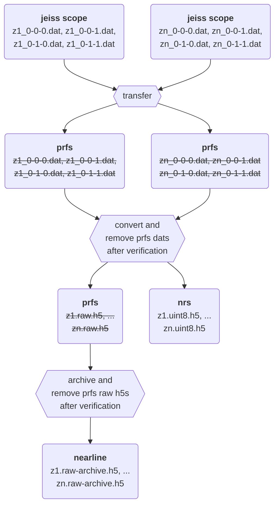

```mermaid
graph TD
    SCOPE_DAT_A(<b>jeiss scope</b><br> z1_0-0-0.dat, z1_0-0-1.dat, <br> z1_0-1-0.dat, z1_0-1-1.dat) --> TRANSFER_DAT
    SCOPE_DAT_B(<b>jeiss scope</b><br> zn_0-0-0.dat, zn_0-0-1.dat, <br> zn_0-1-0.dat, zn_0-1-1.dat) --> TRANSFER_DAT
    TRANSFER_DAT{{transfer}} --> DM11_DAT_A & DM11_DAT_B
    DM11_DAT_A(<b>prfs</b><br><s> z1_0-0-0.dat, z1_0-0-1.dat, <br> z1_0-1-0.dat, z1_0-1-1.dat </s>) --> DAT_TO_H5
    DM11_DAT_B(<b>prfs</b><br><s> zn_0-0-0.dat, zn_0-0-1.dat <br> zn_0-1-0.dat, zn_0-1-1.dat </s>) --> DAT_TO_H5
    DAT_TO_H5{{ convert and <br> remove prfs dats <br> after verification }} --> DM11_RAW_H5 & NRS_ALIGN_H5
    DM11_RAW_H5(<b>prfs</b><br><s> z1.raw.h5, ...<br> zn.raw.h5 </s>) --> ARCHIVE_H5
    NRS_ALIGN_H5(<b>nrs</b><br> z1.uint8.h5, ...<br> zn.uint8.h5)
    ARCHIVE_H5{{archive and <br> remove prfs raw h5s <br> after verification}} --> NEARLINE_RAW_H5
    NEARLINE_RAW_H5(<b>nearline</b><br> z1.raw-archive.h5, ...<br> zn.raw-archive.h5)
```