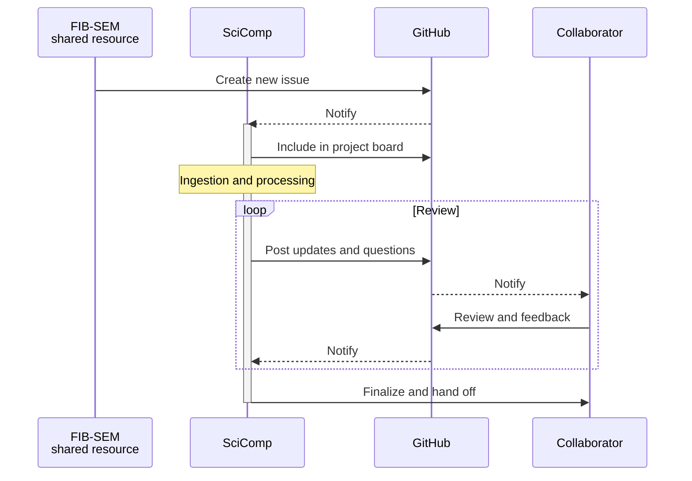

# Project management
All projects are tracked on the [recon_fibsem repository](https://github.com/JaneliaSciComp/recon_fibsem) on GitHub.
This repository is used for documenting and exchanging the information necessary to ingest and process new datasets, tracking the progress of the processing, and reviewing the processed datasets.

## Issues
For every new dataset, an issue is opened. What information should be included and what processes this triggers is detailed in [part 1 of the pipeline documentation](steps/2-1_render_import.md). Here, we concentrate on the management of the issues.

Generally, GitHub is mainly used to track the progress of the processing and to communicate with the collaborators. This can be sped up by assigning the issue to the responsible person, by using labels, and by tagging people from which feedback is needed.

### Labels

There are three different categories of labels:

- **Workflow labels**: `00: imaging in progress`, `01: prep done`, `02: alignment done`, `03: alignment review done`, `04: z correction done`, `05: streak correction done`, `06: intensity correction done`, `07: straightening done`, `09: clean-up done`
- **Collaborator labels**: `Cell Map`, `eFIB-SEM SR` (the FIB-SEM shared resource), `Fly EM`
- **TODO labels**: `needs alignment`, `needs clean-up`, `needs cross-correlation`, `needs N5 creation`, `needs review`, `needs straightening`, `needs streak correction`, `non-rigid tile deformations`, `alignment review concerns`

Each dataset should have the right collaborator label. Apart from that, there are no strict rules about labeling. Use the TODO labels as needed to keep track of what needs to be done. The workflow labels are used to document the processing steps that have been done. When a dataset is done processing, usually all workflow labels below 06 are removed, as they are recorded in the issue history anyway.

### Project board

All issues are collected on the [project board](https://github.com/JaneliaSciComp/recon_fibsem/projects/1), which has four columns:

- **Alignment**: All new issues are automatically entered in this column and stay there during the all standard processing steps.
- **Review**: Once processing is done, the issue is moved to this column, where Preibisch and the collaborators have a final look at it. If further processing is necessary, the issue stays in this column for the time necessary to address all issues.
- **Done**: Once the dataset passes the review process, it is moved to this column to signal that we don’t do further processing on the dataset. The dataset is now ready to be handed off to the collaborator.
- **Cleaned Up**: Once the collaborator has taken over the dataset and has indicated that no further processing is necessary, the issue is moved to this column. At this stage all intermediate data that was used for processing (including 8bit images for alignment) are deleted. This clean up is only done irregularly if disk space is scarce.