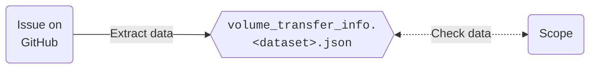
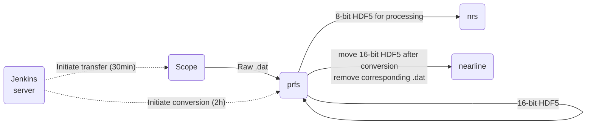

# Transfer data from scope to shared filesystem

```bash
# Commonly used paths
EMRP_ROOT="/groups/flyem/data/render/git/EM_recon_pipeline"
TRANSFER_INFO_DIR="src/resources/transfer_info/cellmap"
TRANSFER_DIR="/groups/flyem/home/flyem/bin/dat_transfer/2022"
```

## Get necessary metadata

There is an issue template that has to be filled out by the FIB-SEM shared resource to gather necessary data for subsequent processing. This information should be converted to a file called `volume_transfer_info.<dataset>.json`, where `<dataset>` is the dataset name as specified by the collaborator. No dashes should be in the project name since MongoDB doesn't like them that much. This file should be put under `${TRANSFER_INFO_DIR}` in your own copy of this repository and committed.

It is best to double-check the validity of the data from the GitHub issue. Sometimes, some post-processing is necessary to make sure all necessary data are present and correct. To this end, log into the scope as user `flyem` and navigate to the `root_keep_path` specified in the issue, e.g.:
```bash
su flyem
ssh jeiss7.hhmi.org
cd /cygdrive/d/UploadFlags
```
Make sure that the following data are correct:
* `SampleID` and `root_dat_path`, which can be directly seen from the filenames listed in the directory; the `root_dat_path` should not have any timestamp in it;
* `columns_per_z_layer` and `rows_per_z_layer`, which can be inferred from the file suffix, e.g., `*_0-1-3.dat` being the highest suffix means that there are 2 rows and 4 columns.

This is also a good point to check if there is enough space on the collaborator's drives for the data and to increase the quota if necessary.

## Transfer and conversion

To set up transfer, make sure that `volume_transfer_info.<dataset>.json` is in `${EMPR_ROOT}/${TRANSFER_INFO_DIR}`. Then, go to `${TRANSFER_DIR}` and execute
```bash
./00_setup_transfer.sh cellmap/volume_transfer_info.<dataset>.json
```
This will copy the json file into `${TRANSFER_DIR}/config`, where it can be found by the processes run by the Jenkins server.

### Configuring and starting the Jenkins server for transfer
1. Log in to [the server](https://jenkins.int.janelia.org) and navigate to your scope under the FlyEM tab.
2. If the process is not enabled, enable it.
3. To test the process, go to the build steps of the configuration menu and select a short amount of time (e.g. 2min instead of 29min) and hit `Build now`. Make sure that the test run doesn't overlap with a scheduled run (happening every 30min - look at past runs and note that the time is in GMT).
4. If the run is successful (check in run > console output), set the time back to 29min and save the configuration.

The Jenkins process for conversion should always be running and happens every two hours. Note that everything resides under the FlyEM tab even if the current acquisition is done by the FIB-SEM shared resource for another collaborator, since the shared resources was initially founded for FlyEM, so the name has historic reasons.

## Set up processing directory
To set up a directory for subsequent processing, execute `11_setup_volume.sh` in `${TRANSFER_DIR}`. This will copy all relevant scripts for processing from this directory to a directory on `prfs` specified in `volume_transfer_info.<dataset>.json`.

## Update GitHub issue
To automatically create a text with all relevant links for the GitHub issue, execute `gen_github_text.sh` in the processing directory. This text can be used to update the issue description.
