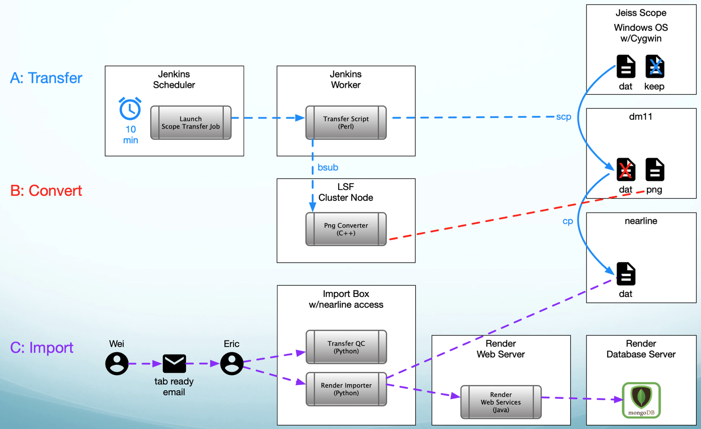

# Reconstruction Part 1: Render Import
## Common Parameters
```bash
export BSUB_HOST="login1.int.janelia.org"
export NEARLINE_HOST="e06u14.int.janelia.org" 
export BASE_WORK_DIR="/groups/flyem/data/alignment/flyem-alignment-ett/Z0720-07m"
```
## Setup Work Area
```bash
# Run on host with access to /nearline because that is where .dat files are stored.
ssh ${NEARLINE_HOST}

cd ${BASE_WORK_DIR}

# Create work area ${BASE_WORK_DIR}/${REGION}/${TAB} with copies of pipeline scripts.
#
#   USAGE: ./setup.sh <region> <tab>  ( e.g. ./setup.sh VNC Sec32 )
./setup.sh VNC Sec26
```
## Validate and Correct Scope File Transfers
The Fly EM image transfer process continuously polls the EM scopes for new data 
and then copies (and converts) that data to centralized network filesystems.
The process works most of the time, but occasionally files are not transferred.
It is important to ensure that all data has been properly transferred 
before deriving and importing metadata into the Render web services.

### Transfer Process (for context)

### Validation Steps
```bash
# While still on nearline host ...
cd VNC/Sec26 # cd ${BASE_WORK_DIR}/${REGION}/${TAB}

# Run as flyem user so that scopes can be reached and corrections can be written.
su flyem

# Use date range from transferred files to go back to scope and get listing of
# all files acquired during that time.
./01_gen_scope_dat_file_lists.sh

# Look for missing and/or misplaced files. 
# InLens png, Transferred dat, Archived dat, Scope dat, and Logs counts should be the same.
# Nothing should be missing.
./02_check_tabs.sh

| ====================================================
| Tab: Z0720-07m_VNC_Sec26
|
| InLens png  Transferred dat  Archived dat  Scope dat       Logs
| ----------  ---------------  ------------  ---------  ---------
|     119187           119187        119187     119208     119187
|
|         21 missing InLens png: ['Merlin-6285_21-08-23_084156_0-0-0', 'Merlin-6285_21-08-23_084156_0-0-1', 'Merlin-6285_2
|         21 missing dat:        ['Merlin-6285_21-08-23_084156_0-0-0', 'Merlin-6285_21-08-23_084156_0-0-1', 'Merlin-6285_2
|          0 unarchived dat:     []
|          0 non-standard dat:   []
         
# In this example, 21 dat files (along with their corresponding png files) are missing
# so we need to try to transfer the dat files again.
# This script serially scp's each missing dat file and converts it to png.  
./03_fetch_missing_dat.sh

# Re-run the check: nothing should be missing now unless the source files are corrupted in some way.
./02_check_tabs.sh

| ====================================================
| Tab: Z0720-07m_VNC_Sec26
|
| InLens png  Transferred dat  Archived dat  Scope dat       Logs
| ----------  ---------------  ------------  ---------  ---------
|     119208           119208        119208     119208     119208
| 
|          0 missing InLens png: []
|          0 missing dat:        []
|          0 unarchived dat:     []
|          0 non-standard dat:   []
         
# Verify the total dat file count and the first and last dat file names 
# match what Wei thinks they should be.  Wei typically emails the names and counts 
# but sometimes you need to ask Wei to send the information.
#
# TODO: merge this information into the check tabs tool
./list_first_and_last_dats.sh 

# Once everything looks good, exit from the flyem shell.
exit
```

## Import Metadata into Render Web Services
```bash
# While still on nearline host in ${BASE_WORK_DIR}/${REGION}/${TAB} and as yourself ...

# Run script that parses dat headers, generates JSON tile specs, and imports them into render.
# Current process sets up a 32-worker dask cluster to do the import, so you may need to
# reconfigure the number of dask workers if your nearline host does not have enough cores.  
./06_dat_to_render.sh

# Once import completes everything else needs to launch from an LSF submit host,
# so exit from the nearline host.
exit
```
