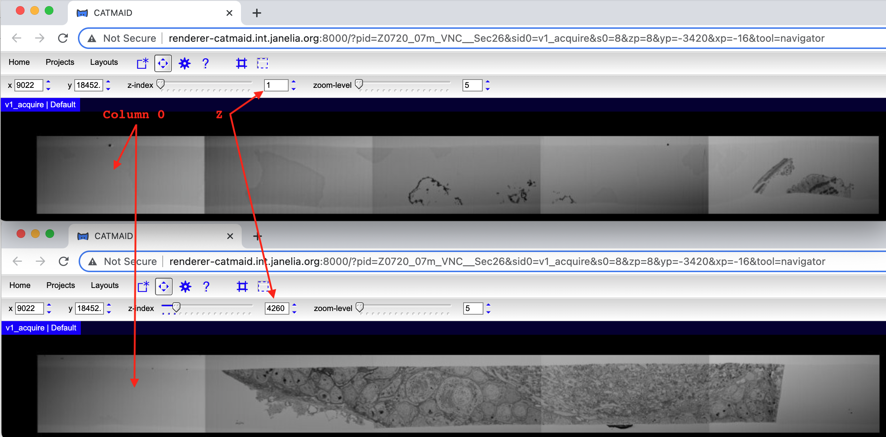
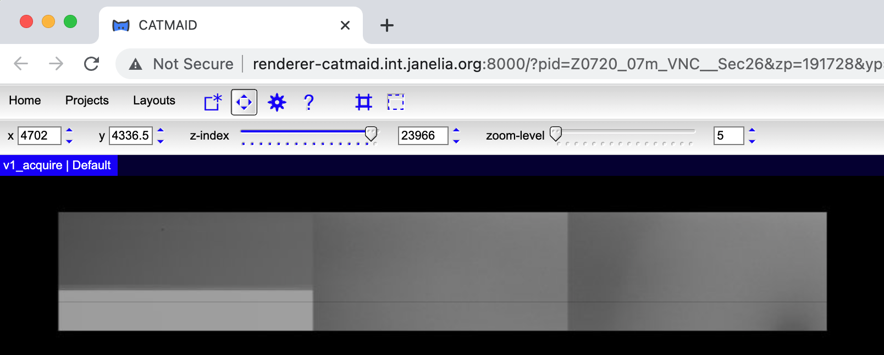

# Reconstruction Part 3: Review Matches and Fix Connectivity Issues
## Common Parameters
```bash
export BSUB_HOST="login1.int.janelia.org"
export BASE_WORK_DIR="/groups/flyem/data/alignment/flyem-alignment-ett/Z0720-07m"
export WORK_DIR="${BASE_WORK_DIR}/VNC/Sec26" # more generically: ${BASE_WORK_DIR}/${REGION}/${TAB}
```
## Generate Connected Tile Cluster Data
<font color="orange">VNC Sec26 Processing Time:</font> 5 minutes using 1 core

```bash
# Continue on LSF / bsub submit host because most work will be done using LSF cluster.
ssh ${BSUB_HOST}
cd ${WORK_DIR}

# Use a single node interactive session because cluster counting usually 
# takes a few minutes and you don't want to cause trouble on the submit host.
bsub -n 1 -P flyem -Is /bin/bash --login

# Extract match counts for entire volume and identify all connected tile clusters.
# Ultimately, there should be one and only one connected tile cluster.  
./21_count_acquire_clusters.sh

| Connected tile cluster counts will be written to:
|   /groups/flyem/data/alignment/flyem-alignment-ett/Z0720-07m/VNC/Sec26/logs/cluster_count.v1_acquire.log
|
| Be patient, this could take a few minutes ...
|
| Parsing /groups/flyem/data/alignment/flyem-alignment-ett/Z0720-07m/VNC/Sec26/logs/cluster_count.v1_acquire.log to create:
|   /groups/flyem/data/alignment/flyem-alignment-ett/Z0720-07m/VNC/Sec26/excluded_columns.json

# Exit interactive session and return to the submit host to review results.
exit
```

## Trim Unconnected Resin Tiles
<font color="orange">VNC Sec26 Processing Time:</font> 15 minutes using 1 core (review), 1 minute using 52 cores (create trimmed stack)

Most volumes have some tiles with just resin in them, especially at the beginning and end of an 
acquisition.  If the resin isn't dirty enough, those tiles won't produce point match correspondences 
with adjacent tiles creating smaller connected clusters or "islands".  The alignment solve process 
requires a single connected set of tiles as input, so we need to remove clusters of purely resin tiles 
and fix/patch missing connections for tiles that have tissue.

The `excluded_columns.json` file produced by `./21_count_acquire_clusters.sh` contains column and z range 
information for all connected clusters.  There are usually many many tiny clusters in resin areas that 
can be combined into one or just a few larger clusters for removal (trimming).  Unfortunately, 
combining/reducing the small resin clusters is currently a manual process.

The `excluded_columns.json` file looks like this: 
```javascript
[
    { "columnNumbers": [
            "0",
            "0"
        ],
        "minZ": 1,
        "maxZ": 4244
    },
    {
        "columnNumbers": [
            "0",
            "0"
        ],
        "minZ": 4245,
        "maxZ": 4455
    },
    {
        "columnNumbers": [
            "0",
            "0"
        ],
        "minZ": 4456,
        "maxZ": 4459
    }, ...
```
To combine/reduce resin clusters, use CATMAID (or any tile viewer) to confirm that the column only contains 
resin tiles and then edit `excluded_columns.json` accordingly.


                                  
For this mini-example, the combined json for column 0 would look like:
```javascript
[
    { "columnNumbers": ["0"], "minZ": 1, "maxZ": 4459 }, 
    ...
]
```

After combining/reducing all resin tile columns in VNC Sec26, the final `excluded_columns.json` file 
looks like this:
```javascript
[
    { "columnNumbers": [ "0" ], "minZ":     1, "maxZ":  4471 },
    { "columnNumbers": [ "0" ], "minZ": 23965, "maxZ": 24154 },
    { "columnNumbers": [ "0" ], "minZ": 25777, "maxZ": 25867 },
    { "columnNumbers": [ "1" ], "minZ":     1, "maxZ":  2900 },
    { "columnNumbers": [ "1" ], "minZ": 25245, "maxZ": 25365 },
    { "columnNumbers": [ "3" ], "minZ": 21797, "maxZ": 21911 },
    { "columnNumbers": [ "4" ], "minZ": 18750, "maxZ": 21911 }
]
```

Once `excluded_columns.json` is ready ...
```bash
# Generate a trimmed (clip) stack by submitting a bsub array job. 
./22_gen_clip_stack.sh
```

## Review Connectivity for Trimmed Stack
<font color="orange">VNC Sec26 Processing Time:</font> 30 minutes using 1 core *(time can vary widely depending upon connection issues)*

Once the trimmed stack has been created and completed (you should receive an email) ...
```bash
# Re-count connected tile clusters for the trimmed stack.
./23_count_trimmed_clusters.sh

| Connected tile cluster counts will be written to:
|   /groups/flyem/data/alignment/flyem-alignment-ett/Z0720-07m/VNC/Sec26/logs/cluster_count.v1_acquire_trimmed.log
|
|  Be patient, this could take a few minutes ...
|
|  20:56:16.141 [main] INFO  [org.janelia.render.client.ClusterCountClient] findConnectedClustersForSlab: slab z 24995.0 to 25776.0 has 1 connected tile sets with sizes [1032]
|  20:56:16.141 [main] INFO  [org.janelia.render.client.ClusterCountClient] findConnectedClusters: found 1 connected tile set with size [108155]
|  20:56:16.291 [main] INFO  [org.janelia.render.client.ClusterCountClient] findConnectedClusters: 108155 tile set with first tile 21-08-19_194752_0-0-2.1.0 and last tile 21-09-14_134854_0-0-0.25776.0
|  20:56:16.291 [main] INFO  [org.janelia.render.client.ClusterCountClient] findConnectedClusters: found 3 completely unconnected tiles: [21-09-06_113017_0-0-4.18749.0, 21-09-13_091915_0-0-1.23966.0, 21-09-13_091915_0-0-2.23966.0]
|  20:56:16.291 [main] INFO  [org.janelia.render.client.ClientRunner] run: exit, processing completed in 0 hours, 1 minutes, 20 seconds

# In this case, the count log output shows that there is now only 1 cluster (that's good) but 
# that there are 3 completely unconnected tiles.  These tiles need to be checked and fixed ...  
```

The first unconnected tile `21-09-06_113017_0-0-4.18749.0` was orphaned by our earlier trim and can be 
fixed by simply editing `excluded_columns.json`
```javascript
{ "columnNumbers": [ "4" ], "minZ": 18750, "maxZ": 21911 } -> 
{ "columnNumbers": [ "4" ], "minZ": 18749, "maxZ": 21911 }
```

The other two unconnected tiles `21-09-13_091915_0-0-1.23966.0` and `21-09-13_091915_0-0-2.23966.0` happened to 
be corrupted during acquisition:



To fix this kind of problem, we usually patch the corrupted tiles with tiles from an adjacent layer.

## Patch Corrupted Tiles
<font color="orange">VNC Sec26 Processing Time:</font> 45 minutes using essentially 1 core

The current patch process has several manual steps and is a little messy.  

Run `./setup_patch.sh` to create a patch subdirectory with the scripts needed for patching:

```bash
# USAGE: ./setup_patch.sh [patch z] ...
# In this case, the z to patch is 23966 (from unconnected tile info).
./setup_patch.sh 23966

| Copy these patch tile id lines into
| /groups/flyem/data/alignment/flyem-alignment-ett/Z0720-07m/VNC/Sec26/v2_patch/06_patch_tile_specs.py:
| 
|          ("21-09-13_091915_0-0-1.23966.0", -1),  # patch from prior layer
|          ("21-09-13_091915_0-0-2.23966.0", -1),  # patch from prior layer
| 
| After patching, generate match pairs by running:
| ./11_gen_new_pairs.sh 23966

# move into the patch subdirectory
cd v2_patch
```

Edit `06_patch_tile_specs.py` to insert the tile ids (copied from the setup script output) to 
be patched.  The setup script defaults to patching from the previous layer `(tile_id, -1)` but in
this case the following layer looks better so the data was changed to `(tile_id, 1)`.  It is a good 
idea to view the area around the patch in CATMAID before deciding the best way to patch it.
```python
def main():
    owner = "Z0720_07m_VNC"        # TODO: update with BR or VNC
    project = "Sec26"             # TODO: update with Sec number
    stack = "v2_acquire_trimmed"  # TODO: update with patch version number

    # TODO: update tile ids
    tile_ids_to_patch = [
         ("21-09-13_091915_0-0-1.23966.0", 1),  # patch from next layer
         ("21-09-13_091915_0-0-2.23966.0", 1),  # patch from next layer
    ]
```

Copy the `v1_acquire_trimmed` stack to `v2_acquire_trimmed` (with the updated excluded_columns.json):
```bash
# Create and immediately submit copy job:
./01_gen_new_trimmed_stack.sh

# Once the copy job completes, patch tiles in the `v2_acquire_trimmed` stack:
./06_patch_tile_specs.py

| submitting PUT http://tem-services.int.janelia.org:8080/render-ws/v1/owner/Z0720_07m_VNC/project/Sec26/stack/v2_acquire_trimmed/state/LOADING
| submitting DELETE http://tem-services.int.janelia.org:8080/render-ws/v1/owner/Z0720_07m_VNC/project/Sec26/stack/v2_acquire_trimmed/tile/21-09-13_091915_0-0-1.23966.0
| submitting DELETE http://tem-services.int.janelia.org:8080/render-ws/v1/owner/Z0720_07m_VNC/project/Sec26/stack/v2_acquire_trimmed/tile/21-09-13_091915_0-0-2.23966.0
| submitting PUT http://tem-services.int.janelia.org:8080/render-ws/v1/owner/Z0720_07m_VNC/project/Sec26/stack/v2_acquire_trimmed/resolvedTiles for 2 tile specs
| submitting PUT http://tem-services.int.janelia.org:8080/render-ws/v1/owner/Z0720_07m_VNC/project/Sec26/stack/v2_acquire_trimmed/state/COMPLETE

# Generate matches for the patched tiles:
./11_gen_new_pairs.sh 23966

| ... (similar output to when this script was originally run for alignment prep)

./12_gen_staged_match_run.sh

| ... (similar output to when this script was originally run for alignment prep)

# Run both montage and cross bsub-array.sh scripts (full paths are in gen script output).
run_20220206_093430_479_multi_stage_match_montage/bsub-array.sh
run_20220206_093430_511_multi_stage_match_cross/bsub-array.sh

# The match jobs should finish quickly since they only cover a few tiles.
# After receiving email confirmation of their completion,
# re-count connected tile clusters for the v2 trimmed stack.
./23_count_trimmed_clusters.sh

| Connected tile cluster counts will be written to:
|   /groups/flyem/data/alignment/flyem-alignment-ett/Z0720-07m/VNC/Sec26/logs/cluster_count.v2_acquire_trimmed.log
| 
| Be patient, this could take a few minutes ...
| 
| 09:57:35.971 [main] INFO  [org.janelia.render.client.ClusterCountClient] findConnectedClustersForSlab: slab z 24995.0 to 25776.0 has 1 connected tile sets with sizes [1032]
| 09:57:35.971 [main] INFO  [org.janelia.render.client.ClusterCountClient] findConnectedClusters: found 1 connected tile set with size [108102]
| 09:57:36.073 [main] INFO  [org.janelia.render.client.ClusterCountClient] findConnectedClusters: 108102 tile set with first tile 21-08-19_194752_0-0-2.1.0 and last tile 21-09-14_134854_0-0-0.25776.0
| 09:57:36.073 [main] INFO  [org.janelia.render.client.ClusterCountClient] findConnectedClusters: found 0 completely unconnected tiles: []
| 09:57:36.073 [main] INFO  [org.janelia.render.client.ClientRunner] run: exit, processing completed in 0 hours, 1 minutes, 9 seconds

# The count log output now shows that there is only 1 cluster and no unconnected tiles 
# We are finally ready to run the alignment solve process.
```