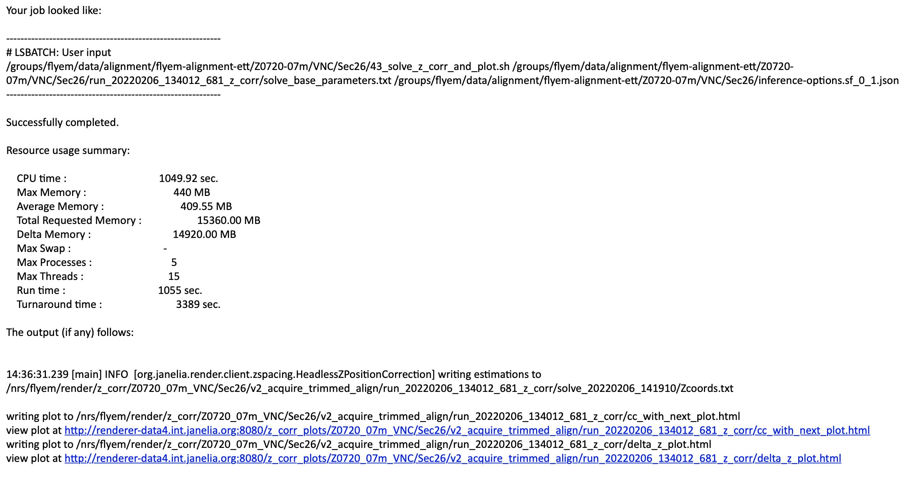
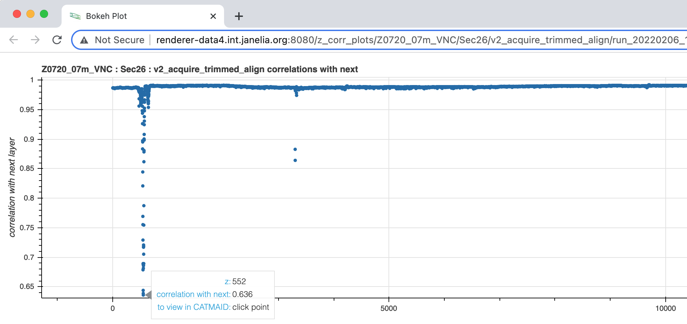
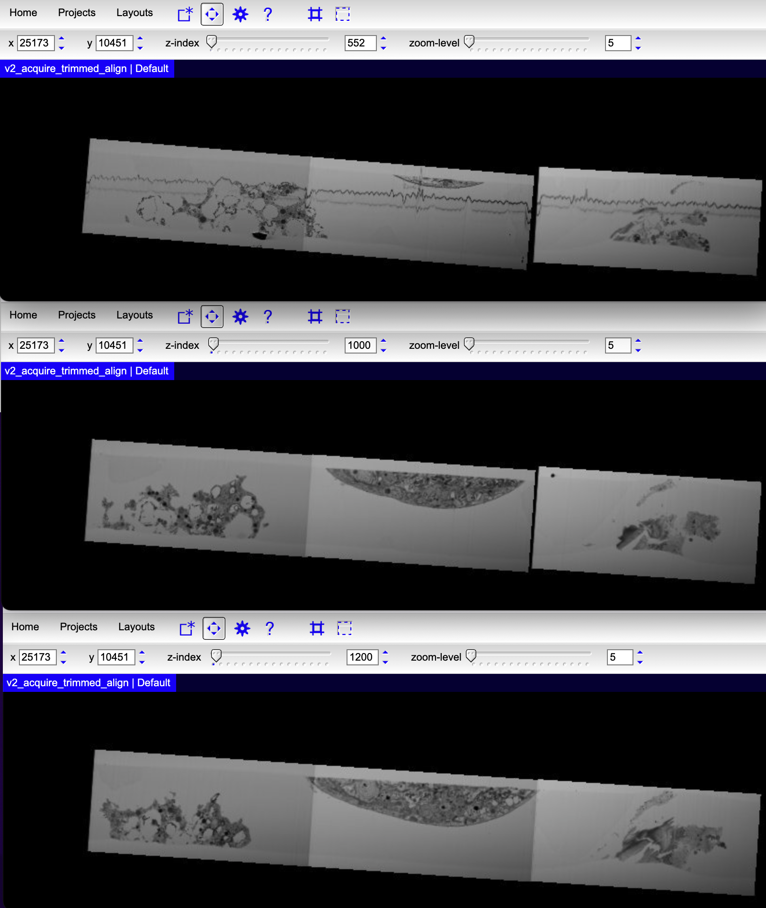

# Reconstruction Part 4: Align Volume
## Common Parameters
```bash
export BSUB_HOST="login1.int.janelia.org"
export BASE_WORK_DIR="/groups/flyem/data/alignment/flyem-alignment-ett/Z0720-07m"
export WORK_DIR="${BASE_WORK_DIR}/VNC/Sec26" # more generically: ${BASE_WORK_DIR}/${REGION}/${TAB}
```
## Generate Alignment Transformations (Run Solve)
<font color="orange">VNC Sec26 Processing Time:</font> 215 minutes using Spark with 18 eleven-core workers, 200 cores in all  

```bash
# Continue on LSF / bsub submit host because most work will be done using LSF cluster.
ssh ${BSUB_HOST}
cd ${WORK_DIR}

# Run solve on Spark ...
#
# Notes:
# - Default block size for distributed solve is 500 z layers 
#   so it is easy to allocate too many workers.
# - Using 12/18/24 workers for small/medium/large tabs works well.
./41_alignment_solve.sh 18
```

## Generate Thickness Correction Data
<font color="orange">VNC Sec26 Processing Time:</font> 112 minutes using 215 cores

The `./41_alignment_solve.sh` script submits a job to run `./42_gen_z_corr_run.sh` 
when the alignment solve job has completed - so there is no need to manually launch 
thickness correction.  The thickness correction data generation process involves a 
distributed z layer cross correlation calculation followed by a solve.  When the 
thickness correction solve completes, interactive plots are generated for cross correlation 
and z correction values and an email with the Zcoords.txt thickness correction data file path 
and URLs for the interactive plots is sent.  The email looks like this:



## Review Thickness Correction Data
<font color="orange">VNC Sec26 Processing Time:</font> 30 minutes using 1 core *(time will vary, does not include patch time for problems)*

Although we ultimately use the thickness correction data to properly render the volume,
we also use the cross correlation information to identify alignment problems.  
For the Fly EM volumes, we've found that properly aligned layers typically have a 
cross correlation value `>= 0.98`.

This plot of the `v2_acquire_trimmed` alignment shows that something is wrong around `z 552`:



Clicking on the problem plot point, opens a CATMAID browser window for the z layer.
You can then navigate through the stack to determine what went wrong during alignment.



In this case, `z 552` has a big wave going through it and the third tile (in cell 0,2) is not 
connected to its neighbor.  That cell remains disconnected until the `z 1200` area.  To correct
the problem, we can either remove/trim the cell tiles or add point matches to better connect the tiles 
and prevent them from drifting apart during the solve process.  Removal is the best option 
when the tiles do not contain any useful information.  In all other cases, the tile connections 
should be improved.

## Correct Alignment Issues
If alignment issues are found, corrections are performed 
using the [patch process](recon_p03_review_matches.md#patch-corrupted-tiles) 
with an incremented patch version number.  You then repeat the solve and review processes 
until you have a clean alignment. 